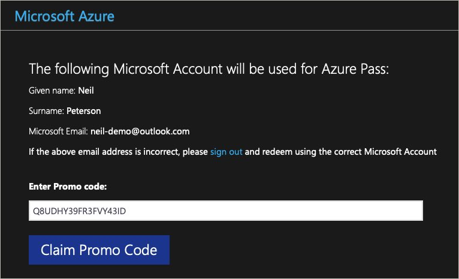
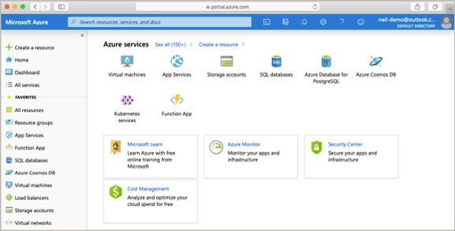

# Workshop Introduction

## Azure Trial

For those attending this workshop in person, a free Azure trail (no card needed) will be provided. If you would like to have this workshop presented to your organization, please contact @nepeters on Twitter.

To set up our Azure trial subscription, visit [Microsoft Azure Passes](https://www.microsoftazurepass.com?WT.mc_id=cloudnativeterraform-github-nepeters).

When prompted enter the provided trial code and complete the remainder of the form.

An Azure subscription will be provisioned for you. Once completed, you will be given access to the Azure Portal.

## Next Module

In the next module, you will create a simple resource using Terraform.

Module 2: [Terraform Hello World](../02-hello-world)