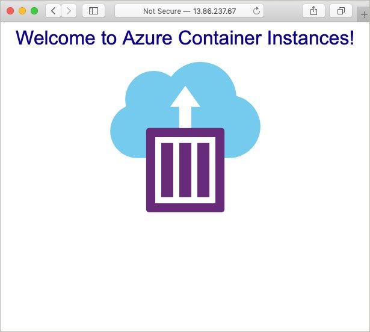

# Terraform Expression Syntax

## Module Overview

Terraform expressions allows you to consume varriables, resource attributes, and data from other data sources within your Terraform configurations.

In this module, you will work with expressions. You will also be introduced to the `terraform plan` command.

Expressions are a new concept in Terraform 0.12.0, see the [Expressions documentation](https://www.terraform.io/docs/configuration/expressions.html) for full details.

## Update configuration to include a Container Instance resource

Open the previously created configuration found in the `main.tf` file and add a new resource (Azure Container Instance) to the configuration.

Replace the contentes of **main.tf** with the following configuration.

```
resource "azurerm_resource_group" "hello-world" {
  name     = "hello-world"
  location = "eastus"
}

resource "random_integer" "ri" {
  min = 10000
  max = 99999
}

resource "azurerm_container_group" "hello-world" {
  name                = "hello-world"
  location            = azurerm_resource_group.hello-world.location
  resource_group_name = azurerm_resource_group.hello-world.name
  ip_address_type     = "public"
  dns_name_label      = "${azurerm_resource_group.hello-world.name}-${random_integer.ri.result}"
  os_type             = "linux"

  container {
    name   = "hello-world"
    image  = "microsoft/aci-helloworld"
    cpu    = "0.5"
    memory = "1.5"
    ports {
      port     = 80
      protocol = "TCP"
    }
  }
}
```

Notice two things about the configuration.

**a.** The container instance needs to be created inside of the resource group.

To solve this, an expression is used to interpolate the resource group names into the container

**b.** The container instance must have a globally unique fully qualified domain name.

This is solved using a second Terraform provider named **random** to generate a random string that can be appended to a base FQDN name.


## Apply the configuration

Run `terraform init` to ensure the directory is initialized.

```
terraform init
```

This time instead of running `terraform apply` to run the configuration, use `terraform plan --out plan.out` to visualize what will be created and produce a plan file.

```
terraform plan --out plan.out
```

Use `terraform apply plan.out` to apply the plan.

```
terraform apply plan.out
```

You can validate that the container has been created using the Azure CLI `az contaier list` command.

```
$ az container list -o table

Name         ResourceGroup    Status     Image                     IP:ports          Network    CPU/Memory       OsType    Location
-----------  ---------------  ---------  ------------------------  ----------------  ---------  ---------------  --------  ----------
hello-world  hello-world      Succeeded  microsoft/aci-helloworld  52.191.236.89:80  Public     0.5 core/1.5 gb  Linux     eastus
```

The containers public IP address can be used to see the running application.



## Next Module

In the next module, you will learn about adding both input and output variables to a Terraform configuration.

Module 4: [Terraform Variables](../04-terraform-variables)