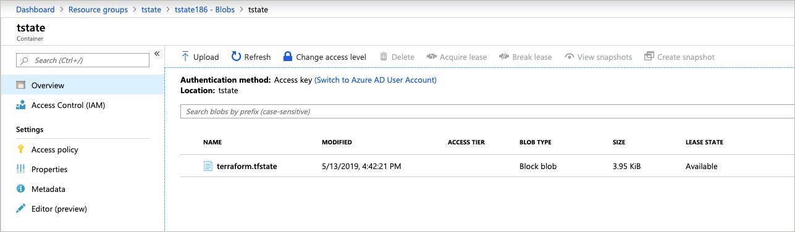

# Terraform State

## Module Overview

Terraform state stores information about your Terraform managed infrastructure. By default, Terraform state is stored locally, however, there are many disadvantages in this configuration:

- Local state does not facilitate collaborative work
- State file may contain sensitive information

To address these issue, Terraform state can be stored in an encrypted and shared back end state store.

In this module, you will create a backend state store in an Azure Storage account and will move the current state to the new backend.

## Create Azure Storage Account

Create a file named `storage.sh`.

```
touch storage.sh
```

Copy in the following script.


```
#!/bin/bash

RESOURCE_GROUP_NAME=tstate
STORAGE_ACCOUNT_NAME=tstate$$
CONTAINER_NAME=tstate

# Create a resource group
az group create --name $RESOURCE_GROUP_NAME --location eastus

# Create storage account
az storage account create --resource-group $RESOURCE_GROUP_NAME --name $STORAGE_ACCOUNT_NAME --sku Standard_LRS --encryption-services blob

# Get storage account key
ACCOUNT_KEY=$(az storage account keys list --resource-group $RESOURCE_GROUP_NAME --account-name $STORAGE_ACCOUNT_NAME --query [0].value -o tsv)

# Create blob container
az storage container create --name $CONTAINER_NAME --account-name $STORAGE_ACCOUNT_NAME --account-key $ACCOUNT_KEY

echo "storage_account_name: $STORAGE_ACCOUNT_NAME"
echo "container_name: $CONTAINER_NAME"
echo "access_key: $ACCOUNT_KEY"
```

Run the script. and take note of the storage account name and access key which can be seen as output once the script has completed.

```
sh storage.sh
```

Once the script has completed, it will output the storage account name and access key. Take note of these values.

```
storage_account_name: tstate653
container_name: tstate
access_key: 2A00000bKxAvWbc3Hy000000000000aMdVvSW13000000000000Trj4YE6RBR000000000000zg6ktNsNluKxg==
```

Store the access key in an environment variable named `ARM_ACCESS_KEY`.

```
export ARM_ACCESS_KEY=<access_key>
```

## Create Terraform Backend

Create a file names `backend.tf` and copy in the following configuration. Update the storage account name to match what was created in the last step.

```
terraform {
  backend "azurerm" {
    storage_account_name  = "<replace>"
    container_name        = "tstate"
    key                   = "terraform.tfstate"
  }
}
```

Reinitialize the directory. Terraform will recognize the new backend configuration and prompt you to copy the existing state to the backend.

```
terraform init
```

At this point, a Terraform state file has been created in the Azure Blob.




Remove the local state files and the storage script.

```
rm terraform.tfstate
rm terraform.tfstate.backup
rm storage.sh
```

## Next Module

In the next module, you will learn about Terraform Workspaces.

Module 7: [Terraform Workspaces](../07-terraform-workspaces)