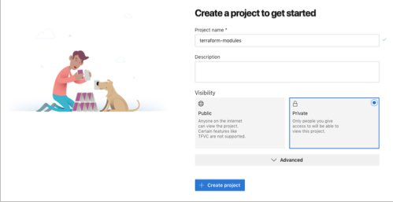
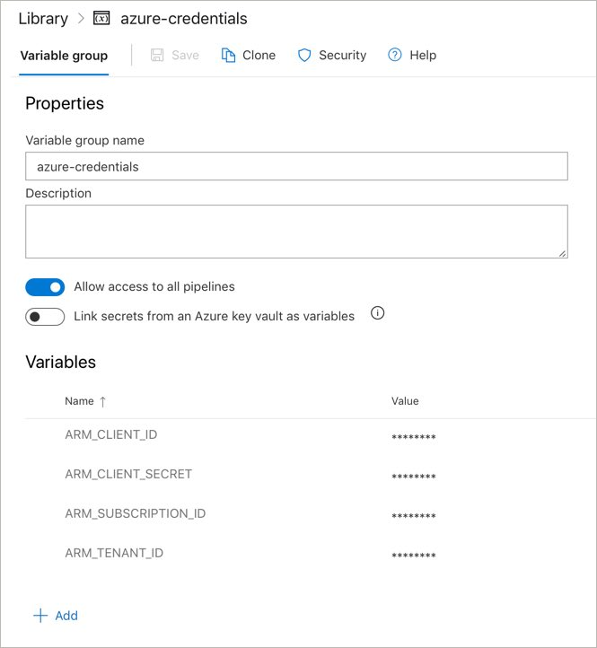
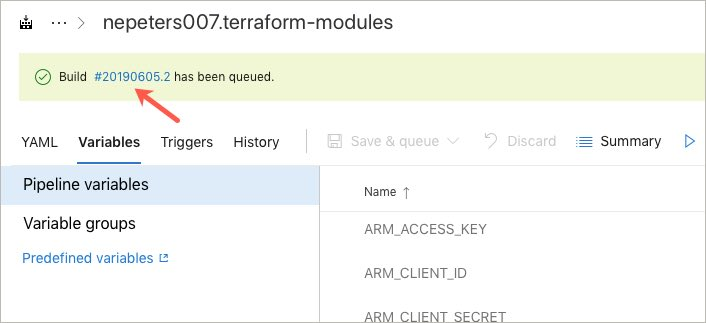
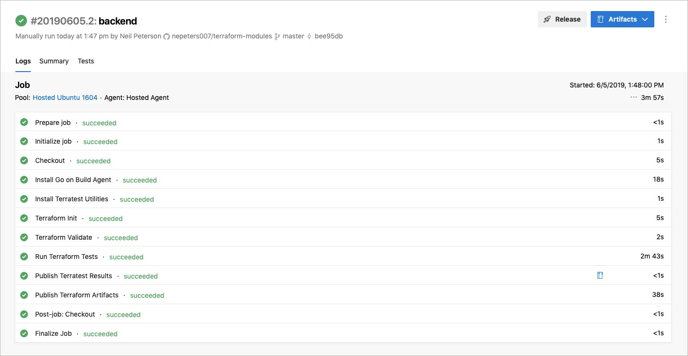

# Automating tests and builds with Azure Pipelines

## Module Overview

In this module, you will create an automated build pipeline that will test your terraform configurations, create a test report, and package up deployable build artifacts.

This module assumes that you have forked [this repository](https://github.com/neilpeterson/terraform-modules) to your personal GitHub account.

## Create an Azure DevOps instance

If needed, [create an Azure DevOps instance](https://azure.microsoft.com/en-ca/services/devops/?WT.mc_id=cloudnativeterraform-github-nepeters). Azure DevOps is free for open source projects, including this workshop.

Once you have created the organization, you may be prompted to create a new project.



## Create Build Pipeline

Create a new build pipeline using the left-hand menu.

*Pipelines* > *Build* > *New Pipeline* > *GitHub (YAML)*


Select the GitHub repository that contains the Terraform configurations. You may be prompted to approve the repository connection.


An Azure build pipeline YAML file has been pre-created in the repository. Select **Existing Azure Pipelines YAML file**.


The pipeline file is named `build-pipeline.yaml`. Enter this value for the path.


At this point, the pipeline should have been imported.


Click the **Run** button to kick off the initial build.

....unfortunately, the build will fail. See the next section for the fix.

## Add Azure Credentials

In order for you to run Terratest integration tests, you will need to provide credentials to the pipeline.

First, use the Azure CLI [az ad sp create-for-rbac](https://docs.microsoft.com/en-us/cli/azure/ad/sp?WT.mc_id=cloudnativeterraform-github-nepeters#az-ad-sp-create-for-rbac) command to create an Azure Service Principal.

```
$ az ad sp create-for-rbac

{
  "appId": "3026b3e5-000-000-0000-3497c48fbee1",
  "displayName": "azure-cli-2019-06-05-06-16-20",
  "name": "http://azure-cli-2019-06-05-06-16-20",
  "password": "48005028-0000-0000-0000-f6063e5e3a1f",
  "tenant": "72f988bf-0000-0000-0000-2d7cd011db47"
}
```

Use the [az account list](https://docs.microsoft.com/en-us/cli/azure/account?WT.mc_id=cloudnativeterraform-github-nepeters#az-account-list) command to find the Azure subscription id.

```
$ az account list -o table

Name                                         CloudName    SubscriptionId                        State    IsDefault
-------------------------------------------  -----------  ------------------------------------  -------  -----------
ca-nepeters-demo-test                        AzureCloud   3000087c-0000-0000-0000-29e5e0000daf  Enabled  True
```

Back in the Azure Pipeline, click **Library** > **Variable Groups**.

Create a variable group named `azure-credentials` and add the following variables, encrypting each one with the lock button.

- **ARM_CLIENT_ID**: The service principal appId.
- **ARM_CLIENT_SECRET**: The service principal password.
- **ARM_TENANT_ID**: The tenant id which can be found with the service principal information.
- **ARM_SUBSCRIPTION_ID**: The Azure subscription id.

When done, the variable group should look like this.



Click on the **Save**, navigate back to the pipeline, and click the **queue** button to start a new build.

Select the build to see the progress.



Once completed, assuming everything went well, you should see all tasks as successful.



## Next Module

In the next module, you will learn about deploying Terraform configurations with Azure Release pipelines.

Module 11: [Continuous Deployment](../11-continuous-deployment)