# Approving and deploying Terraform configuration with Azure Pipelines

## Module Overview

In this module you will create an Azure release pipeline that will deploy the configurations to a 'test' environment, wait for human approval and then deploy the configuration to a 'production' environment.

## Create Release Pipeline

Create a new release pipeline. YAML based release pipelines are in preview and do not yet support manual approvals. We will work with classic pipelines for this workshop.

**Pipelines** > **Release** > **New Pipeline**

Start with an empty job pipeline template.


Name the first stage `Test (Resource Group)`.


Add the deployment artifacts with the **Add** button.

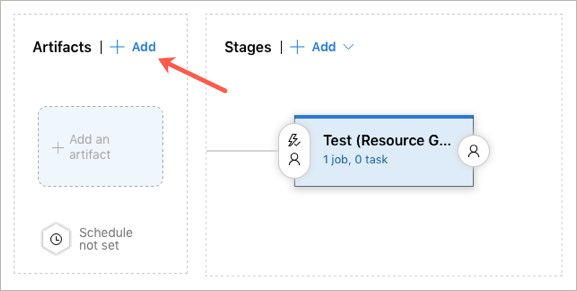

Select the build pipeline, **take note of the source alias**, and click **Add**.


Select the test stage to edit the stage tasks.

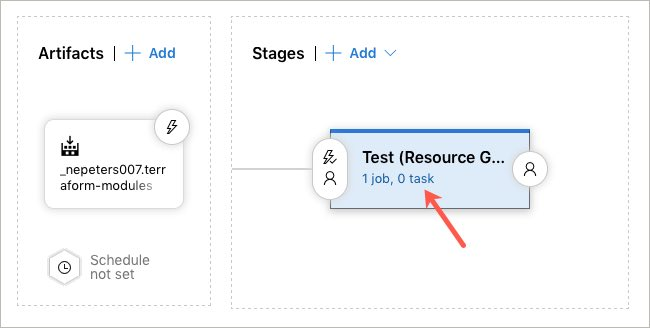

Select **Agent job** and update the **Agent pool** to use `Hosted Ubuntu 1604`.


Add a **Command Line** task, give it a name of `Terraform Deploy Test`.

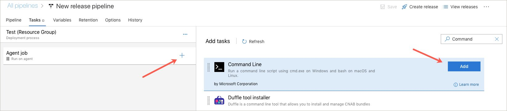

Copy in the following commands.

```
cd source-alias/drop/modules/hello-world
terraform init
terraform plan --out plan.out -var resource_group=hello-world-test-environment -var dns-prefix=hello-world-test-environment
terraform apply plan.out
```

**Update the first line** (source-alias) to include the source alias gather in a previous step.

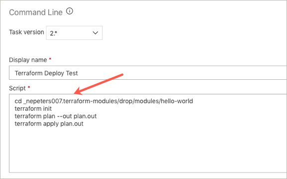

Finally, add Azure credentials to the deployment task.

Select **Variables** > **Variable groups** > **Link Variable Group** > **azure-credentials** > **Link**.

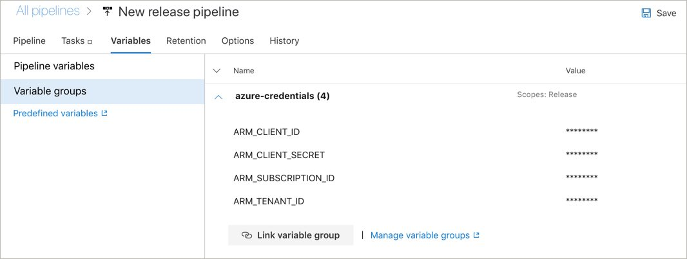

Click back on **Tasks**. On the **Terraform Deploy Test**, expand **Environment Variables** and add the following variables and values. Encrypt each with the lock

| Variable Name | Value |
|---|---|
| ARM_CLIENT_ID | $(ARM_CLIENT_ID) |
| ARM_CLIENT_SECRET | $(ARM_CLIENT_SECRET) |
| ARM_TENANT_ID | $(ARM_TENANT_ID) |
| ARM_SUBSCRIPTION_ID | $(ARM_SUBSCRIPTION_ID) |

When done, the task should look like this.

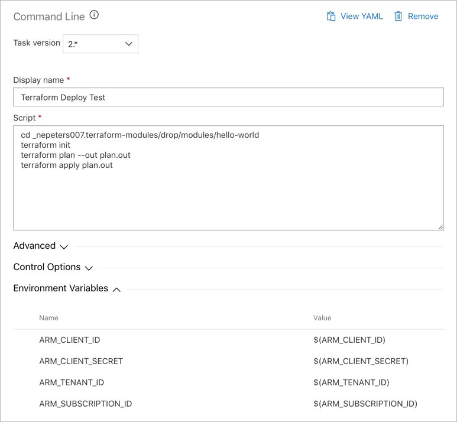

Click **Save** > **ok**.

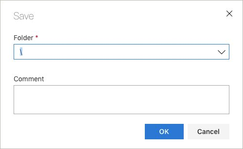

Click the **Create release** button > **Create** > Select the release.

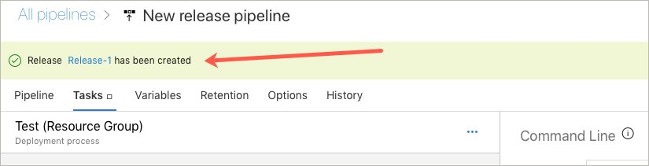

And click the **In progress** link to see the deployment progress.

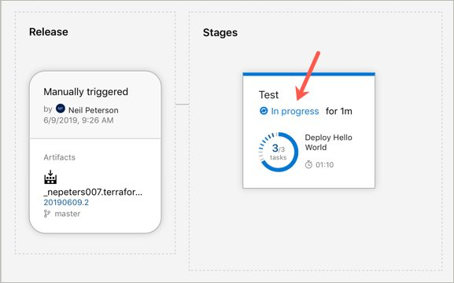

If everything went according to plan, you should have a successful release.

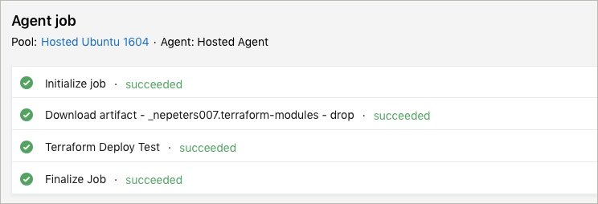


## Create a production stage with approval

Return to the release pipeline, click **Edit**, and clone the test stage.

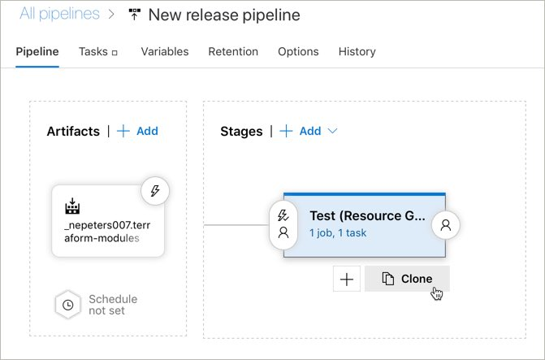

Update the stage and task name so that they indicate a production deployment.

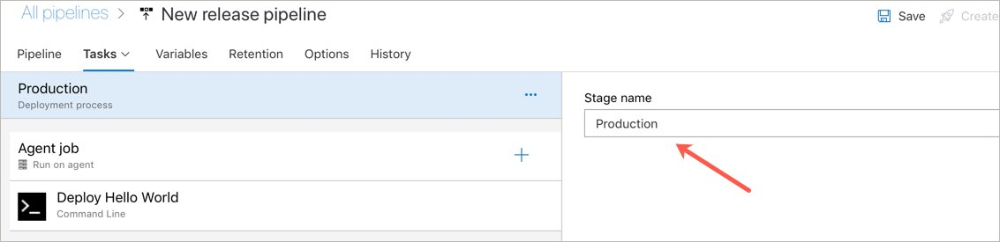

Return to the pipeline and select **pre-deployment conditions** on the production stage.

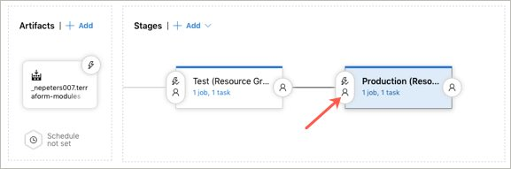

Select **Pre-deployment approvals**, and add your account as an approver.

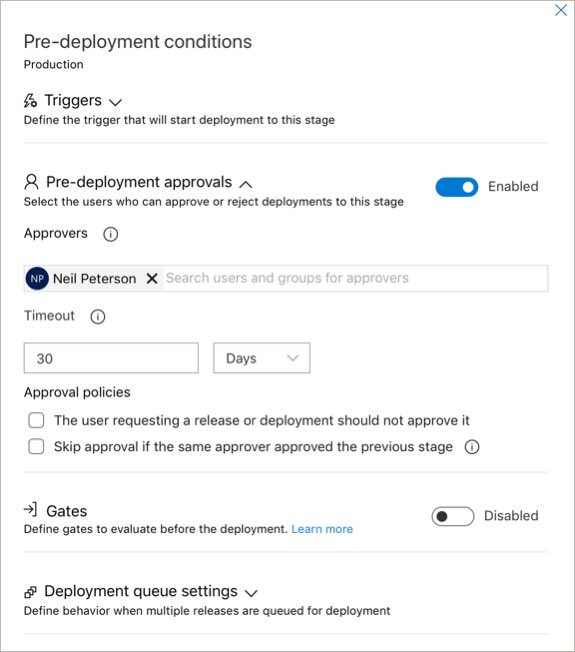

Click **Save** and **Ok**.


Click **Create Release** and **Create** to start a new release and select the release link to observe the status.

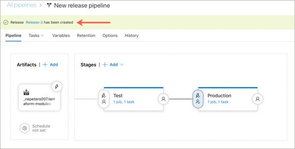

Once the test release has successfully deployed, the production release will need to be approved. Check out the test release, and if it looks good, approve the production release using the approve button.

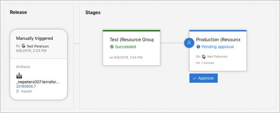

When done, you should see both the test and production release in the Azure portal.

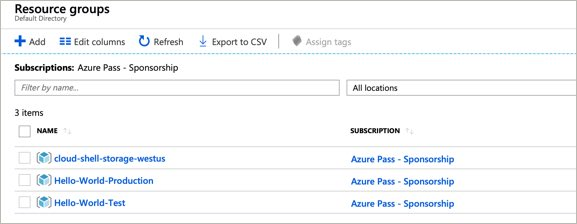

## Extra Credit

These Azure Pipeline examples have not included remote state. As an additional challenge, see if you can insert the logic to store both the test and production state in an Azure backend.