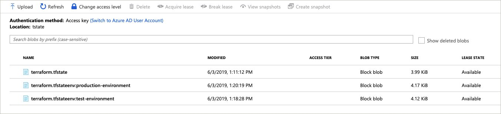

# Terraform Workspaces

## Module Overview

- Configure multiple workspaces
- Workspace interpolation
- Workspaces on the backend

## First Workspace

List the Terraform workspaces with the `terraform workspace list` command. To start, you should have only the `default` workspace.

```
terraform workspace list
```

Create a new workspace with the `terraform workspace new` command.

```
terraform workspace new demo-workspace-001
```

Update the `hello-world` app configuration to interpolate the workspace name into the configuration. This can be done with the `${terraform.workspace}` syntax. In this example, the Azure resource group name and container fqdn are appended with the workspace name.

```
resource "azurerm_resource_group" "hello-world" {
  name     = "${var.resource_group}-${terraform.workspace}"
  location = "${var.location}"
}

resource "azurerm_container_group" "hello-world" {
  name                = "${lower(var.container-name)}"
  location            = "${azurerm_resource_group.hello-world.location}"
  resource_group_name = "${azurerm_resource_group.hello-world.name}"
  ip_address_type     = "public"
  dns_name_label      = "${var.dns-prefix}-${terraform.workspace}"
  os_type             = "linux"

  container {
    name   = "hello-world"
    image  = "${var.container-image}"
    cpu    = "0.5"
    memory = "1.5"
    port   = "80"
  }
}
```

Create a new plan for the hello-world configuration.

```
terraform plan --out plan.out
```

Apply the plan.


```
terraform apply plan.out
```

## Second Workspace

Create a second workspace with the `terraform workspace new` command.

```
terraform workspace new demo-workspace-002
```

Create a new plan for the hello-world configuration.


```
terraform plan --out plan.out
```

Apply the plan.


```
terraform apply plan.out
```

List the Terraform workspaces with the `terraform workspace list` command. You should now see the two new workspaces.

```
$ terraform workspace list

  default
  demo-workspace-001
* demo-workspace-002
```

Taking a look at the backend, we can see the state file for each workspace.



## Remove Workspace

To remove a workspace, first destroy the current configuration and delete the workspace.

Switch to the `demo-workspace-001` workspace.

```
terraform workspace select demo-workspace-001
```

Destroy the configuration.

```
terraform destroy
```

Switch to the `default` workspace.

```
terraform workspace select default
```

Delete the `demo-workspace-001` workspace.

```
workspace delete demo-workspace-001
```

## Issues with workspaces

Workspaces are great, but consider the following issues:

- All state is stored in the same backend. This poses both an issue around access control and error-prone management experience.

Consider using a well-formed directory structure with different backends for production level state isolation.

## Next Module

In the next module, you will learn about Terraform modules.

Module 8: [Terraform Modules](../8-terraform-modules)